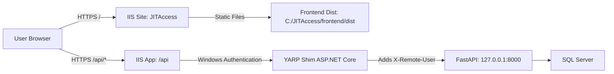
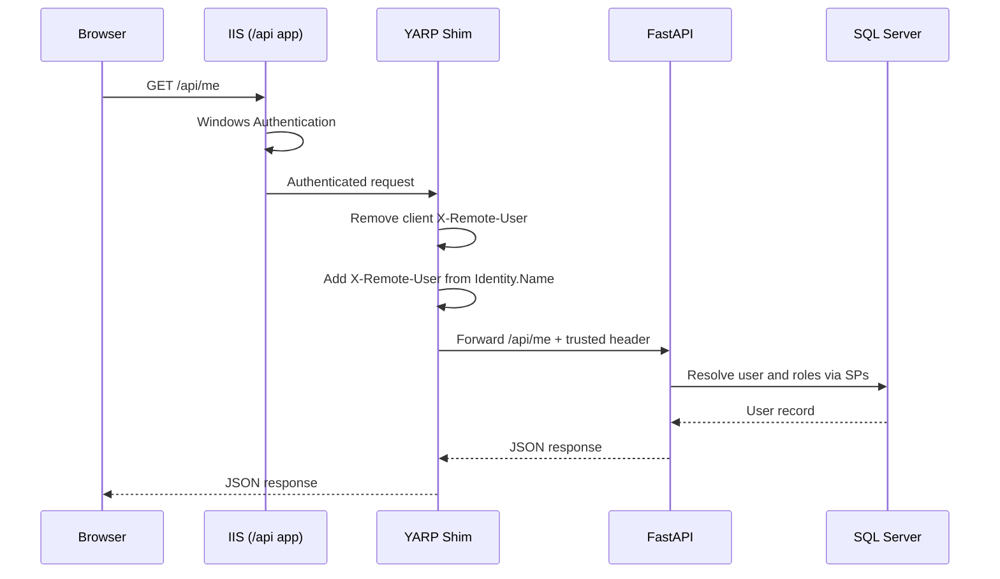

# JIT Access v2 Production Runbook (Offline, IIS + YARP Shim + NSSM)

This runbook is tailored to the current repository structure:
- Frontend: `v2/frontend` (Vite/React)
- Backend: `v2/backend` (FastAPI)
- IIS C# header shim: `IIS/YarpGateway`

It keeps your current `X-Remote-User` forwarding approach via YARP and avoids per-user paths.

## 1. Target Architecture

- Browser -> IIS site `JITAccess` (serves static frontend from `C:\JITAccess\frontend\dist`)
- Browser -> IIS app `/api` -> YARP shim (`C:\JITAccess\yarp`) with Windows Auth
- YARP adds `X-Remote-User` and proxies to FastAPI on `http://127.0.0.1:8000`
- FastAPI runs as Windows service via NSSM (`JITAccess-API`)

Notes:
- No Vite dev server in production.
- No `uvicorn --reload` in production.
- Frontend and API are same-origin (`/api`), so CORS is minimal.

## 1.1 Visual Architecture and Data Flow

### Topology Diagram



### Request/Auth Flow (Sequence)



### Trust Boundary (Spoofing Prevention)

```text
Internet/Client Zone
  Browser can send any custom header (untrusted)
      |
      v
IIS + YARP Trusted Zone
  - Windows Auth establishes identity
  - YARP removes incoming X-Remote-User
  - YARP sets X-Remote-User from authenticated principal
      |
      v
Localhost-only Backend Zone
  FastAPI listens on 127.0.0.1:8000 (not remotely reachable)
```

## 2. Root Path Convention (Server)

Use only root-scoped paths:

- `C:\JITAccess\frontend\dist` -> built frontend
- `C:\JITAccess\backend` -> backend source + `.venv` + `.env`
- `C:\JITAccess\yarp` -> published YARP gateway output
- `C:\JITAccess\logs` -> service logs
- `C:\Installers` -> offline installers copied to server

## 3. What to Prepare on an Internet-Connected Build Machine

Prepare everything before moving to the gapped server.

### 3.1 Required installers / binaries to pre-download

1. Python (exact version you standardize on, x64)  
   Download: `https://www.python.org/downloads/windows/`
2. Node.js LTS x64 (only needed on server if you plan to build there; recommended: build frontend off-server)  
   Download: `https://nodejs.org/en/download`
3. .NET 8 Hosting Bundle (required for ASP.NET Core app in IIS)  
   Entry page: `https://dotnet.microsoft.com/download/dotnet/8.0`  
   (Select **ASP.NET Core Runtime** -> **Hosting Bundle** for Windows x64)
4. NSSM binary (`nssm.exe`)  
   Download: `https://nssm.cc/download`
5. Microsoft ODBC Driver for SQL Server (match your backend config, currently Driver 17)  
   Download page: `https://learn.microsoft.com/sql/connect/odbc/download-odbc-driver-for-sql-server`
6. Visual C++ Redistributable x64 (recommended prerequisite for some native components)  
   Download page: `https://learn.microsoft.com/cpp/windows/latest-supported-vc-redist`

Recommended for offline integrity control:
- Download and store checksums/signatures where available.
- Keep a manifest file with: product name, version, architecture, source URL, checksum, and download date.

Optional (if not already present on server baseline):
- IIS role feature media (if server image does not include IIS)

### 3.2 Build and stage deployable artifacts

From repo root on connected machine:

```powershell
# 1) Frontend production build
cd C:\Repos\JIT-Access-for-Data\v2\frontend
npm ci
npm run build
# Output: v2\frontend\dist
```

```powershell
# 2) Backend offline wheel cache
cd C:\Repos\JIT-Access-for-Data
python -m pip download -r v2\backend\requirements.txt -d C:\staging\jitaccess\backend\wheels
```

```powershell
# 3) Publish YARP shim for IIS deployment
cd C:\Repos\JIT-Access-for-Data
 dotnet publish IIS\YarpGateway\YarpGateway.csproj -c Release -o C:\staging\jitaccess\yarp
```

Also stage these folders/files for transfer:
- `v2\frontend\dist` -> `C:\staging\jitaccess\frontend\dist`
- `v2\backend\*` (exclude `__pycache__`) -> `C:\staging\jitaccess\backend`
- `C:\staging\jitaccess\backend\wheels` (from pip download)
- `C:\staging\jitaccess\yarp` (published gateway)
- SQL scripts from `v2\database\schema` and `v2\database\procedures`

## 4. Server Install (Offline)

Copy staged payload + installers to server, then run as admin.

### 4.1 Install platform prerequisites

Install in this order:
1. IIS + Windows Authentication feature
2. .NET 8 Hosting Bundle
3. Python x64
4. ODBC Driver for SQL Server
5. VC++ Redistributable x64
6. NSSM (extract `nssm.exe` to e.g. `C:\Tools\nssm\nssm.exe`)

### 4.2 Create root folder layout

```powershell
New-Item -ItemType Directory -Force C:\JITAccess\frontend\dist | Out-Null
New-Item -ItemType Directory -Force C:\JITAccess\backend | Out-Null
New-Item -ItemType Directory -Force C:\JITAccess\yarp | Out-Null
New-Item -ItemType Directory -Force C:\JITAccess\logs | Out-Null
```

Copy staged artifacts into these locations.

## 5. Backend Setup (FastAPI)

### 5.1 Create venv and install from offline wheels

```powershell
cd C:\JITAccess\backend
py -3 -m venv .venv

.\.venv\Scripts\python.exe -m pip install --no-index --find-links .\wheels -r .\requirements.txt
```

### 5.2 Configure backend env

Create `C:\JITAccess\backend\.env` with production values (example):

```dotenv
APP_NAME=JIT Access API
APP_ENV=prod
APP_HOST=127.0.0.1
APP_PORT=8000
APP_DEBUG=false

DB_SERVER=YOUR_SQL_SERVER
DB_NAME=DMAP_JIT_PERMISSIONS
DB_DRIVER={ODBC Driver 17 for SQL Server}
DB_USERNAME=YOUR_SQL_LOGIN
DB_PASSWORD=YOUR_SQL_PASSWORD
DB_ENCRYPT=yes
DB_TRUST_SERVER_CERTIFICATE=yes

CORS_ORIGINS=["https://your-jit-hostname"]
JIT_FAKE_USER=
```

Important:
- Keep `JIT_FAKE_USER` empty in production.
- Ensure DB credentials and permissions are correct.

## 6. Database Deployment

Run DB schema/procedure scripts on SQL Server in proper order.

Minimum:
1. `v2/database/schema` scripts
2. `v2/database/procedures/99_Create_All_Procedures.sql` (SQLCMD mode)
3. Optional test data scripts only if this is non-production

Because you requested SQL-first logic, ensure recent procedures are included:
- `sp_Role_ListWithStats`
- updated `sp_Role_ListUsers`

## 7. Configure NSSM Service for FastAPI

Install FastAPI as a Windows service:

```powershell
C:\Tools\nssm\nssm.exe install JITAccess-API "C:\JITAccess\backend\.venv\Scripts\python.exe" "-m uvicorn main:app --host 127.0.0.1 --port 8000 --workers 2"
C:\Tools\nssm\nssm.exe set JITAccess-API AppDirectory "C:\JITAccess\backend"
C:\Tools\nssm\nssm.exe set JITAccess-API Start SERVICE_AUTO_START
C:\Tools\nssm\nssm.exe set JITAccess-API AppStdout "C:\JITAccess\logs\api-out.log"
C:\Tools\nssm\nssm.exe set JITAccess-API AppStderr "C:\JITAccess\logs\api-err.log"
```

Set environment for service process:

```powershell
C:\Tools\nssm\nssm.exe set JITAccess-API AppEnvironmentExtra "APP_ENV=prod" "PYTHONUNBUFFERED=1"
```

Start service:

```powershell
C:\Tools\nssm\nssm.exe start JITAccess-API
```

Validate:

```powershell
curl.exe -I http://127.0.0.1:8000/health
```

## 8. Configure YARP Shim (IIS app)

You are keeping the C# shim, which is valid for your auth-header forwarding requirement.

### 8.1 Update YARP appsettings for FastAPI target

Edit `C:\JITAccess\yarp\appsettings.json` to route to FastAPI and preserve `/api/*` path prefix:

```json
{
  "ReverseProxy": {
    "Routes": {
      "api": {
        "ClusterId": "apiCluster",
        "Match": { "Path": "{**catch-all}" },
        "Transforms": [
          { "PathPrefix": "/api" }
        ]
      }
    },
    "Clusters": {
      "apiCluster": {
        "Destinations": {
          "d1": { "Address": "http://127.0.0.1:8000/" }
        }
      }
    }
  }
}
```

Why `PathPrefix` is needed:
- IIS app mounted at `/api` passes path without `/api` to the app.
- FastAPI routes are defined with `/api/...` prefixes.

## 9. Configure IIS Site + App

### 9.1 Main site for frontend

Create IIS site:
- Site name: `JITAccess`
- Physical path: `C:\JITAccess\frontend\dist`
- Binding: your host/port/cert

Authentication (site root):
- Anonymous: Enabled
- Windows Authentication: Disabled

### 9.2 Add `/api` application for YARP

Under `JITAccess` site, add application:
- Alias: `api`
- Physical path: `C:\JITAccess\yarp`
- App Pool: dedicated pool, `No Managed Code` is acceptable for ASP.NET Core Module hosting

Authentication (application `/api`):
- Windows Authentication: Enabled
- Anonymous Authentication: Disabled

This keeps integrated auth only where needed.

### 9.3 Restart IIS

```powershell
iisreset
```

## 10. Verification Checklist

1. FastAPI service is running:
```powershell
sc.exe query JITAccess-API
```

2. Local API health via backend port:
```powershell
curl.exe -I http://127.0.0.1:8000/health
```

3. Through IIS endpoint:
- Open `https://your-host/`
- Open DevTools network and verify `/api/me` returns 200 for authenticated users

4. Header forwarding sanity test (optional temporary backend log):
- Confirm backend receives `X-Remote-User` as `DOMAIN\\username`

5. Role management data sanity:
- Manage Roles shows description
- `View Users (n)` shows count
- Permission pills render

## 11. Operations

### 11.1 Update deployment

- Replace frontend dist files under `C:\JITAccess\frontend\dist`
- Replace backend code under `C:\JITAccess\backend`
- If dependencies changed, update wheels and reinstall in venv
- Replace YARP publish output if shim changed
- Restart service and app pool:

```powershell
C:\Tools\nssm\nssm.exe restart JITAccess-API
Restart-WebAppPool -Name "JITAccess-api-app-pool"  # use your actual app pool name
```

### 11.2 Log locations

- FastAPI service logs:
  - `C:\JITAccess\logs\api-out.log`
  - `C:\JITAccess\logs\api-err.log`
- IIS logs: standard IIS log directory
- YARP app logs: configure via ASP.NET Core logging if needed

## 12. Hardening Notes

- Run NSSM service under a dedicated AD/service account (not LocalSystem) with least privilege.
- Restrict NTFS ACLs on `C:\JITAccess` to admins + service accounts.
- Use TLS at IIS binding and disable weak protocols/ciphers per baseline.
- Keep `JIT_FAKE_USER` empty in production.
- Pin exact package versions in `requirements.txt` for repeatable offline installs.

## 13. Optional Alternatives (Not applied here)

You asked to keep the C# shim, so this runbook keeps it.

Possible alternatives to evaluate later (not implemented in this runbook):
- Host YARP as standalone Windows service (NSSM) and let IIS reverse proxy to it.
- Host both static frontend and API through a single ASP.NET Core host.

If you want either alternative, vet it first and then I can provide a separate runbook.
